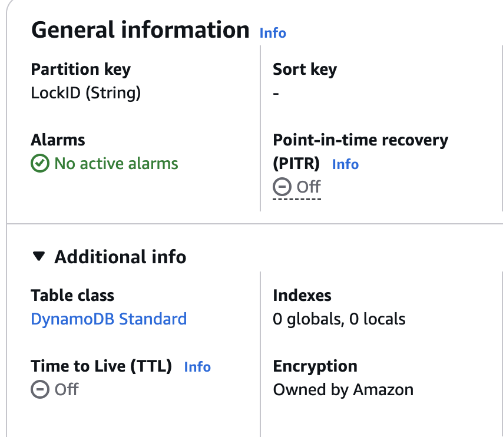

# Technical Test

## Description
This repository is a Terraform project to host a Solution for Financial Clients. 

**Scenario:** You work for a company that provides a financial decisioning platform to financial institutions (we will call them clients here). Each client has their own configuration and data. To comply with data residency laws and SOC2 requirements, your product has to be deployed in multiple AWS regions. 

#### Table of contents
1. [Diagram](#1-diagram-architecture)
2. [Directory Structure](#2-directory-structure)
3. [Multi-Account Strategy ](#3-multi-account-strategy)
4. [How to scale](#4-how-to-scale)
5. [Rest Encryptiom](#5-rest-encryption)
6. [Minimal Pipeline](#6-minimal-pipeline)

### 1. Diagram Architecture


1. **Internet Gateway**: This component allows internet access for the infrastructure. Allows components to be visible through internet.

2. **Application Load Balancer**: An public applicationload balancer  (layer 7 OSI) is provisioned to recept all request for each customer through internet. Used for PII SANITIZER.

3. **NAT Gateway**: This component allows resources inside private subnets to connect to internet to download patches, libraries or consume external services services.

4. **EC2 Instance (PII Sanitizer)**: Instances to host PII sanitizer services, inside EC2 instance is installed Docker Engine to run containers. They are hosted in private subnets.

5. **EKS Cluster**: This resource is created to implement GATEWAY API services, is deployed using 3 nodes across 3 AVAILABILITY ZONES for realibility. There is an Application Load Balancer (internal type) to expose this microservice through a Service Deployment. Located in a private subnet to protect resources.

6. **Lambdas**: This service is used to host Interface Domain services per client.

7. **VPC GATEWAY ENDPOINT**: This component enhances security and latency for S3 and DynamoDb connection. A VPC Gateway Endpoint setup a private connection between AWS Global Services and services located inside a VPC, using AWS internal network.

8. **DynamoDB**: This service is used for Interface Domain lambdas to store data.

9. **S3 Bucket**:  This component is provisioned to store objects by Lambda's Interface Domain

10. **Amazon RDS**: This service is used to host a PostgreSQL database, located in an Isolated subnet to avoid Internet Connection and protect the data.

In terms on Networking, this infrastructure is divided into 5 layers:
- **Public layer (Public Subnets)**: Used to host services that will be exposed through internet and recept requests to redirect them to each compute internal service.

- **PII Sanitizer Layer** (Private subnets): This layer is created to have EC2 instance to host containers to do sanitizing, this service is exposed through internet using a External Load Balancer located in public subnets.

- **Gateway API Layer** (Private subnets): This layer is used to have an EKS cluster to deploy with Kubernetes manifest an GATEWAY API microservice and expose it using a Load Balancer service that creates an Internal Application Load Balancer to recept requests from PII Sanitizer Layer services.

- **Isolated Database Layer** (Isolated subnets): This layer is used to host the databases to protect sensitive data. This layer doesn't have internet access. In case of connection from Dev or Data team, a VPN setup could happend to give them access.

### 2. Directory Structure

```sh
├── modules
│   ├── dynamodb
│   │   ├── main.tf
│   │   ├── outputs.tf
│   │   └── variables.tf
│   ├── eks
│   │   ├── 01-iam-permissions
│   │   │   ├── cluster-access-entry.tf
│   │   │   ├── cluster-role.tf
│   │   │   ├── node-group-role.tf
│   │   │   ├── outputs.tf
│   │   │   └── variables.tf
│   │   ├── 02-cluster
│   │   │   ├── main.tf
│   │   │   ├── outputs.tf
│   │   │   └── variables.tf
│   │   ├── 03-cluster-node-group
│   │   │   ├── main.tf
│   │   │   ├── outputs.tf
│   │   │   └── variables.tf
│   │   └── 04-add-ons
│   │       ├── addons-permissions.tf
│   │       ├── main.tf
│   │       └── variables.tf
│   ├── lambda
│   │   ├── data.tf
│   │   ├── main.tf
│   │   └── variables.tf
│   ├── network
│   │   ├── 01-vpc
│   │   │   ├── main.tf
│   │   │   ├── outputs.tf
│   │   │   ├── variables.tf
│   │   │   └── versions.tf
│   │   ├── 02-subnets
│   │   │   ├── main.tf
│   │   │   ├── outputs.tf
│   │   │   ├── variables.tf
│   │   │   └── version.tf
│   │   ├── 03-internet-gateway
│   │   │   ├── main.tf
│   │   │   ├── outputs.tf
│   │   │   └── variables.tf
│   │   ├── 04-nat-gateway
│   │   │   ├── main.tf
│   │   │   ├── outputs.tf
│   │   │   └── variables.tf
│   │   └── 05-route-tables
│   │       ├── main.tf
│   │       ├── outputs.tf
│   │       └── variables.tf
│   ├── pii-sanitizer
│   │   ├── 01-security_groups.tf
│   │   ├── 02-key-pairs.tf
│   │   ├── 03-ec2-instance.tf
│   │   ├── 04-alb.tf
│   │   ├── outputs.tf
│   │   └── variables.tf
│   ├── rds
│   │   ├── main.tf
│   │   └── variables.tf
│   └── s3-buckets
│       ├── main.tf
│       ├── outputs.tf
│       └── variables.tf
├── us-east-1
│   ├── env
│   │   ├── dev
│   │   └── prod
│   │       ├── clients
│   │       │   ├── financial-client-a
│   │       │   │   ├── Inference-Domain
│   │       │   │   │   ├── backend.hcl
│   │       │   │   │   ├── code.py
│   │       │   │   │   ├── code.zip
│   │       │   │   │   ├── data.tf
│   │       │   │   │   ├── main.tf
│   │       │   │   │   ├── providers.tf
│   │       │   │   │   ├── values.tfvars
│   │       │   │   │   ├── variables.tf
│   │       │   │   │   └── version.tf
│   │       │   │   ├── PII-Sanitizer
│   │       │   │   │   ├── backend.hcl
│   │       │   │   │   ├── data.tf
│   │       │   │   │   ├── main.tf
│   │       │   │   │   ├── providers.tf
│   │       │   │   │   ├── user_data.sh
│   │       │   │   │   ├── values.tfvars
│   │       │   │   │   ├── variables.tf
│   │       │   │   │   └── version.tf
│   │       │   │   ├── apply.sh
│   │       │   │   ├── destroy.sh
│   │       │   │   ├── plan.sh
│   │       │   │   └── validate.sh
│   │       │   └── financial-client-b
│   │       │       ├── Inference-Domain
│   │       │       └── PII-Sanitizer
│   │       ├── database
│   │       │   ├── apply.sh
│   │       │   ├── backend.hcl
│   │       │   ├── data.tf
│   │       │   ├── destroy.sh
│   │       │   ├── main.tf
│   │       │   ├── plan.sh
│   │       │   ├── providers.tf
│   │       │   ├── validate.sh
│   │       │   ├── values.tfvars
│   │       │   ├── variables.tf
│   │       │   └── version.tf
│   │       ├── gateway-api-eks
│   │       │   ├── 01-iam-permissions
│   │       │   │   ├── eks-iam-backend.hcl
│   │       │   │   ├── eks-iam.tfvars
│   │       │   │   ├── main.tf
│   │       │   │   ├── outputs.tf
│   │       │   │   ├── providers.tf
│   │       │   │   └── variables.tf
│   │       │   ├── 02-cluster
│   │       │   │   ├── cluster-backend.hcl
│   │       │   │   ├── cluster.tfvars
│   │       │   │   ├── data.tf
│   │       │   │   ├── main.tf
│   │       │   │   ├── outputs.tf
│   │       │   │   ├── providers.tf
│   │       │   │   ├── variables.tf
│   │       │   │   └── version.tf
│   │       │   ├── 03-node-group
│   │       │   │   ├── data.tf
│   │       │   │   ├── main.tf
│   │       │   │   ├── ng-backend.hcl
│   │       │   │   ├── node-group.tfvars
│   │       │   │   ├── providers.tf
│   │       │   │   ├── variables.tf
│   │       │   │   └── version.tf
│   │       │   ├── 04-addons
│   │       │   │   ├── addons-backend.hcl
│   │       │   │   ├── addons.tfvars
│   │       │   │   ├── data.tf
│   │       │   │   ├── main.tf
│   │       │   │   ├── providers.tf
│   │       │   │   ├── variables.tf
│   │       │   │   └── version.tf
│   │       │   ├── apply.sh
│   │       │   ├── destroy.sh
│   │       │   ├── plan.sh
│   │       │   └── validate.sh
│   │       └── network
│   │           ├── 01-vpc
│   │           │   ├── main.tf
│   │           │   ├── outputs.tf
│   │           │   ├── providers.tf
│   │           │   ├── terraform.tfstate
│   │           │   ├── variables.tf
│   │           │   ├── version.tf
│   │           │   ├── vpc-backend.hcl
│   │           │   └── vpc.tfvars
│   │           ├── 02-subnets
│   │           │   ├── data.tf
│   │           │   ├── main.tf
│   │           │   ├── outputs.tf
│   │           │   ├── providers.tf
│   │           │   ├── subnets-backend.hcl
│   │           │   ├── subnets.tfvars
│   │           │   ├── terraform.tfstate
│   │           │   ├── variables.tf
│   │           │   └── version.tf
│   │           ├── 03-internet-gateway
│   │           │   ├── data.tf
│   │           │   ├── igw-backend.hcl
│   │           │   ├── igw.tfvars
│   │           │   ├── main.tf
│   │           │   ├── outputs.tf
│   │           │   ├── providers.tf
│   │           │   ├── terraform.tfstate
│   │           │   ├── variables.tf
│   │           │   └── version.tf
│   │           ├── 04-nat-gateway
│   │           │   ├── data.tf
│   │           │   ├── main.tf
│   │           │   ├── nat-backend.hcl
│   │           │   ├── nat.tfvars
│   │           │   ├── outputs.tf
│   │           │   ├── providers.tf
│   │           │   ├── terraform.tfstate
│   │           │   ├── variables.tf
│   │           │   └── version.tf
│   │           ├── 05-route-tables
│   │           │   ├── data.tf
│   │           │   ├── main.tf
│   │           │   ├── outputs.tf
│   │           │   ├── providers.tf
│   │           │   ├── rtb-backend.hcl
│   │           │   ├── rtb.tfvars
│   │           │   ├── terraform.tfstate
│   │           │   ├── variables.tf
│   │           │   └── version.tf
│   │           ├── 06-endpoints
│   │           │   ├── data.tf
│   │           │   ├── endpoints-backend.hcl
│   │           │   ├── main.tf
│   │           │   ├── providers.tf
│   │           │   ├── terraform.tfstate
│   │           │   ├── variables.tf
│   │           │   └── version.tf
│   │           ├── apply.sh
│   │           ├── destroy.sh
│   │           ├── plan.sh
│   │           └── validate.sh
│   └── global
│       ├── dynamodb
│       │   ├── main.tf
│       │   └── variables.tf
│       ├── main.tf
│       ├── provider.tf
│       ├── s3
│       │   ├── main.tf
│       │   └── variables.tf
│       ├── terraform.tfstate
│       ├── var.tfvars
│       └── variables.tf
└── us-east-2
    ├── env
    │   ├── dev
    │   └── prod
    │       ├── clients
    │       │   ├── financial-client-c
    │       │   └── financial-client-d
    │       ├── database
    │       ├── gateway-api-eks
    │       └── network
    └── global

56 directories, 178 files
➜  uplinq git:(main) ✗ tree
.
├── README.md
├── image.png
├── modules
│   ├── dynamodb
│   │   ├── main.tf
│   │   ├── outputs.tf
│   │   └── variables.tf
│   ├── eks
│   │   ├── 01-iam-permissions
│   │   │   ├── cluster-access-entry.tf
│   │   │   ├── cluster-role.tf
│   │   │   ├── node-group-role.tf
│   │   │   ├── outputs.tf
│   │   │   └── variables.tf
│   │   ├── 02-cluster
│   │   │   ├── main.tf
│   │   │   ├── outputs.tf
│   │   │   └── variables.tf
│   │   ├── 03-cluster-node-group
│   │   │   ├── main.tf
│   │   │   ├── outputs.tf
│   │   │   └── variables.tf
│   │   └── 04-add-ons
│   │       ├── addons-permissions.tf
│   │       ├── main.tf
│   │       └── variables.tf
│   ├── lambda
│   │   ├── data.tf
│   │   ├── main.tf
│   │   └── variables.tf
│   ├── network
│   │   ├── 01-vpc
│   │   │   ├── main.tf
│   │   │   ├── outputs.tf
│   │   │   ├── variables.tf
│   │   │   └── versions.tf
│   │   ├── 02-subnets
│   │   │   ├── main.tf
│   │   │   ├── outputs.tf
│   │   │   ├── variables.tf
│   │   │   └── version.tf
│   │   ├── 03-internet-gateway
│   │   │   ├── main.tf
│   │   │   ├── outputs.tf
│   │   │   └── variables.tf
│   │   ├── 04-nat-gateway
│   │   │   ├── main.tf
│   │   │   ├── outputs.tf
│   │   │   └── variables.tf
│   │   └── 05-route-tables
│   │       ├── main.tf
│   │       ├── outputs.tf
│   │       └── variables.tf
│   ├── pii-sanitizer
│   │   ├── 01-security_groups.tf
│   │   ├── 02-key-pairs.tf
│   │   ├── 03-ec2-instance.tf
│   │   ├── 04-alb.tf
│   │   ├── outputs.tf
│   │   └── variables.tf
│   ├── rds
│   │   ├── main.tf
│   │   └── variables.tf
│   └── s3-buckets
│       ├── main.tf
│       ├── outputs.tf
│       └── variables.tf
├── us-east-1
│   ├── env
│   │   ├── dev
│   │   └── prod
│   │       ├── clients
│   │       │   ├── financial-client-a
│   │       │   │   ├── Inference-Domain
│   │       │   │   │   ├── backend.hcl
│   │       │   │   │   ├── code.py
│   │       │   │   │   ├── code.zip
│   │       │   │   │   ├── data.tf
│   │       │   │   │   ├── main.tf
│   │       │   │   │   ├── providers.tf
│   │       │   │   │   ├── values.tfvars
│   │       │   │   │   ├── variables.tf
│   │       │   │   │   └── version.tf
│   │       │   │   ├── PII-Sanitizer
│   │       │   │   │   ├── backend.hcl
│   │       │   │   │   ├── data.tf
│   │       │   │   │   ├── main.tf
│   │       │   │   │   ├── providers.tf
│   │       │   │   │   ├── user_data.sh
│   │       │   │   │   ├── values.tfvars
│   │       │   │   │   ├── variables.tf
│   │       │   │   │   └── version.tf
│   │       │   │   ├── apply.sh
│   │       │   │   ├── destroy.sh
│   │       │   │   ├── plan.sh
│   │       │   │   └── validate.sh
│   │       │   └── financial-client-b
│   │       │       ├── Inference-Domain
│   │       │       └── PII-Sanitizer
│   │       ├── database
│   │       │   ├── apply.sh
│   │       │   ├── backend.hcl
│   │       │   ├── data.tf
│   │       │   ├── destroy.sh
│   │       │   ├── main.tf
│   │       │   ├── plan.sh
│   │       │   ├── providers.tf
│   │       │   ├── validate.sh
│   │       │   ├── values.tfvars
│   │       │   ├── variables.tf
│   │       │   └── version.tf
│   │       ├── gateway-api-eks
│   │       │   ├── 01-iam-permissions
│   │       │   │   ├── eks-iam-backend.hcl
│   │       │   │   ├── eks-iam.tfvars
│   │       │   │   ├── main.tf
│   │       │   │   ├── outputs.tf
│   │       │   │   ├── providers.tf
│   │       │   │   └── variables.tf
│   │       │   ├── 02-cluster
│   │       │   │   ├── cluster-backend.hcl
│   │       │   │   ├── cluster.tfvars
│   │       │   │   ├── data.tf
│   │       │   │   ├── main.tf
│   │       │   │   ├── outputs.tf
│   │       │   │   ├── providers.tf
│   │       │   │   ├── variables.tf
│   │       │   │   └── version.tf
│   │       │   ├── 03-node-group
│   │       │   │   ├── data.tf
│   │       │   │   ├── main.tf
│   │       │   │   ├── ng-backend.hcl
│   │       │   │   ├── node-group.tfvars
│   │       │   │   ├── providers.tf
│   │       │   │   ├── variables.tf
│   │       │   │   └── version.tf
│   │       │   ├── 04-addons
│   │       │   │   ├── addons-backend.hcl
│   │       │   │   ├── addons.tfvars
│   │       │   │   ├── data.tf
│   │       │   │   ├── main.tf
│   │       │   │   ├── providers.tf
│   │       │   │   ├── variables.tf
│   │       │   │   └── version.tf
│   │       │   ├── apply.sh
│   │       │   ├── destroy.sh
│   │       │   ├── plan.sh
│   │       │   └── validate.sh
│   │       └── network
│   │           ├── 01-vpc
│   │           │   ├── main.tf
│   │           │   ├── outputs.tf
│   │           │   ├── providers.tf
│   │           │   ├── terraform.tfstate
│   │           │   ├── variables.tf
│   │           │   ├── version.tf
│   │           │   ├── vpc-backend.hcl
│   │           │   └── vpc.tfvars
│   │           ├── 02-subnets
│   │           │   ├── data.tf
│   │           │   ├── main.tf
│   │           │   ├── outputs.tf
│   │           │   ├── providers.tf
│   │           │   ├── subnets-backend.hcl
│   │           │   ├── subnets.tfvars
│   │           │   ├── terraform.tfstate
│   │           │   ├── variables.tf
│   │           │   └── version.tf
│   │           ├── 03-internet-gateway
│   │           │   ├── data.tf
│   │           │   ├── igw-backend.hcl
│   │           │   ├── igw.tfvars
│   │           │   ├── main.tf
│   │           │   ├── outputs.tf
│   │           │   ├── providers.tf
│   │           │   ├── terraform.tfstate
│   │           │   ├── variables.tf
│   │           │   └── version.tf
│   │           ├── 04-nat-gateway
│   │           │   ├── data.tf
│   │           │   ├── main.tf
│   │           │   ├── nat-backend.hcl
│   │           │   ├── nat.tfvars
│   │           │   ├── outputs.tf
│   │           │   ├── providers.tf
│   │           │   ├── terraform.tfstate
│   │           │   ├── variables.tf
│   │           │   └── version.tf
│   │           ├── 05-route-tables
│   │           │   ├── data.tf
│   │           │   ├── main.tf
│   │           │   ├── outputs.tf
│   │           │   ├── providers.tf
│   │           │   ├── rtb-backend.hcl
│   │           │   ├── rtb.tfvars
│   │           │   ├── terraform.tfstate
│   │           │   ├── variables.tf
│   │           │   └── version.tf
│   │           ├── 06-endpoints
│   │           │   ├── data.tf
│   │           │   ├── endpoints-backend.hcl
│   │           │   ├── main.tf
│   │           │   ├── providers.tf
│   │           │   ├── terraform.tfstate
│   │           │   ├── variables.tf
│   │           │   └── version.tf
│   │           ├── apply.sh
│   │           ├── destroy.sh
│   │           ├── plan.sh
│   │           └── validate.sh
│   └── global
│       ├── dynamodb
│       │   ├── main.tf
│       │   └── variables.tf
│       ├── main.tf
│       ├── provider.tf
│       ├── s3
│       │   ├── main.tf
│       │   └── variables.tf
│       ├── terraform.tfstate
│       ├── var.tfvars
│       └── variables.tf
└── us-east-2
    ├── env
    │   ├── dev
    │   └── prod
    │       ├── clients
    │       │   ├── financial-client-c
    │       │   │   ├── Interface-Domain
    │       │   │   └── PII-Sanitizer
    │       │   └── financial-client-d
    │       ├── database
    │       ├── gateway-api-eks
    │       └── network
    └── global
```

- `modules` directory is used to have reusable templates that can be called to make infrastructures, these modules are implemented with best cloud practices related with security, realibility and mantainability.

- `us-east-1` and `us-east-2` directories represent regions in which Infrastructure will be deployed, this Level is called region directory level, because more regions could be added like us-west-1, us-west-2

- `env` directory is to define environment to use, like production `prod`, development `dev`, among others. In each envinronment will be located infrastructure components.

- `clients` this directory is used to create customer dedicated/isolated resources for `Interface Domain` and `PII Satinizer`. Each customer will have their own directory (like `financial-client-c`).

- `database` this directory is used to create RDS database that will be connected to GATEWAY API

- `gateway-api-eks` this directory is used to create a Kubernetes Cluster using AWS solution (EKS). This cluster will host GATEWAY API deployments.
    - This component is shared through Node Groups Security Groups that allows traffic from PII SATINIZER SUBNETS CIDR BLOCKS

- `network` this directory defines network settings, like route tables, vpc endpoints, subnets, vpc, internet gateway, nat gateway.

- `global` directory is used to deploy General resources, like IAM ROLES, USERS, GROUPS that will be used by all services in that region. For example, for this solution is defined a s3 bucket and a dynamodb table to store terraform states and lock terraform configs respectively.

Something important to notice is that each directory has its own terraform state that allows each component setting keeps isolated and protected. Each state is stored in an S3 bucket:


Each component establishes a connection through `data.tf` calling terraform states.

```sh
data "terraform_remote_state" "tf_vpc" {
  backend = "s3"
  config = {
    bucket = "uplinq-infra"
    key = "us-east-1/env/prod/network/vpc/terraform.tfstate"
    region = "us-east-1"
  }
}
```

### 3. Multi-Account Strategy 

In an AWS environment, a multi-account strategy is manage using AWS Organizations. Creating an Organization to add dev, stg, prod, logging and security accounts. With this setup SCP policies could be applied to grant permissions to each account.


About accounts communication, we can configure:
- a VPN Site-to-Site connection could be established to communicate services between connection.
- Cross-Account Roles to grant access to AWS services that belong to an specific account.

### 4. How to scale

1. **Scale to additional regions**: This structure allows to create a new region in root directory. Inside each region directory this schema is repeated several times:

```sh
<REGION_CODE>
    ├── env
    │   └── <ENVIRONMENT_NAME>
    │       ├── clients
    │       │   ├── <CLIENT_NAME>
    │       │   │   ├── Interface-Domain
    │       │   │   └── PII-Sanitizer
    │       │   └── <CLIENT_NAME>
    │       ├── database
    │       ├── gateway-api-eks
    │       └── network
    └── global
```

2. **Scale to additional clients**: Inside `clients` directory a new client could be added following the following structure:

```
├── clients
    ├── <CLIENT_NAME>
    │       ├── Interface-Domain
    │       └── PII-Sanitizer
    └── <CLIENT_NAME>
```

> IMPORTANT: For each client add following bash scripts to handle terraform actions: `apply.sh` `destroy.sh` `plan.sh` `validate.sh`

### 5. Rest Encryption

- Rest encryption is implemented for each storage service using AWS ENCRYPTION Default feature. Nowdays, AWS lets us implement default encryption in this service using KMS keys managed by AWS. Ex:




```sh
resource "aws_db_instance" "uplinq_database" {

  storage_encrypted     = true

}
```

### 6. Minimal Pipeline.

Minimal pipeline implemented to provision Network, GATEWAY API, PII SANITIZER and Inference domain


